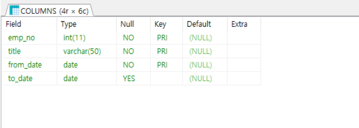

*이 문서는 'K-digital IoT 프로젝트' 수업을 통해 배운 내용을 적어 놓은 복습용 파일 입니다. 따라서 순서나 주제에서 살짝 벗어난 내용이 있을 수 있습니다.*

# SQL 

### SQL 문법의 종류

SQL 문법은 크게 3가지 종류로 나누어지며, 종류마다 정의는 아래와 같다.

- DDL (Data Definition Language, 데이터 정의 언어)

  > EX) CREATE, ALTER, DROP ...

- DML (Data Manipulation Language, 데이터 조작 언어)

  > EX) SELECT, INSERT, UPDATE, DELETE ...

- DCL (Data Control Language, 데이터 제어 언어)

  > EX) GRANT, REVOKE ...


### SQL 기본

> *데이터를 구축하기 위해서 공부에 사용한 교재의 샘플 데이터베이스를 사용하였습니다.*

- DESC : 테이블의 구조를 출력

  ```
  > use employees   -- sample data named employees
  > DESC titles;	
  ```

  

  > *이 때, Key값인지 여부를 묻는 Key 란에, 3개나 표시가 되어있다. 하지만 모든 테이블에 Primary Key는 하나여야 한다. 이 의미는 PK가 3개가 아니라, 3가지 정보를 묶은 것을 하나의 PK로 사용하겠다는 뜻이다.*

  > *모든 테이블에 PK가 필수는 아니다. 하지만 필수라고 생각하는게 좋다. 따라서 PK 가 없을 땐, 관리를 위해 새로운 행을 만든다. 제일 쉬운 방법은 numbering 이다!*
  >

- SELECT : 테이블의 위치 출력


