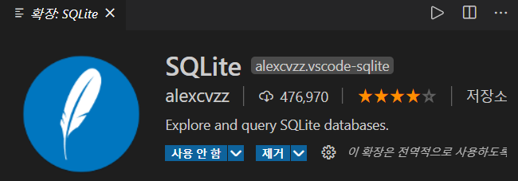
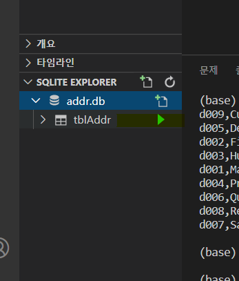
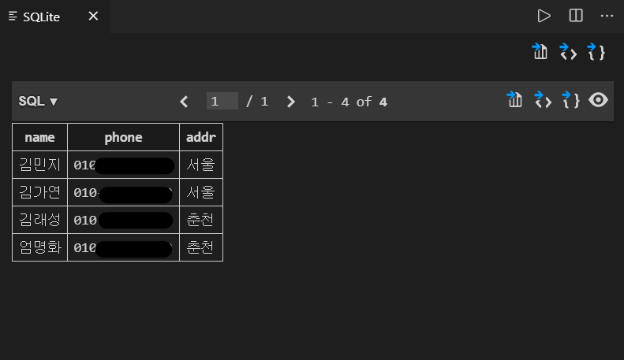
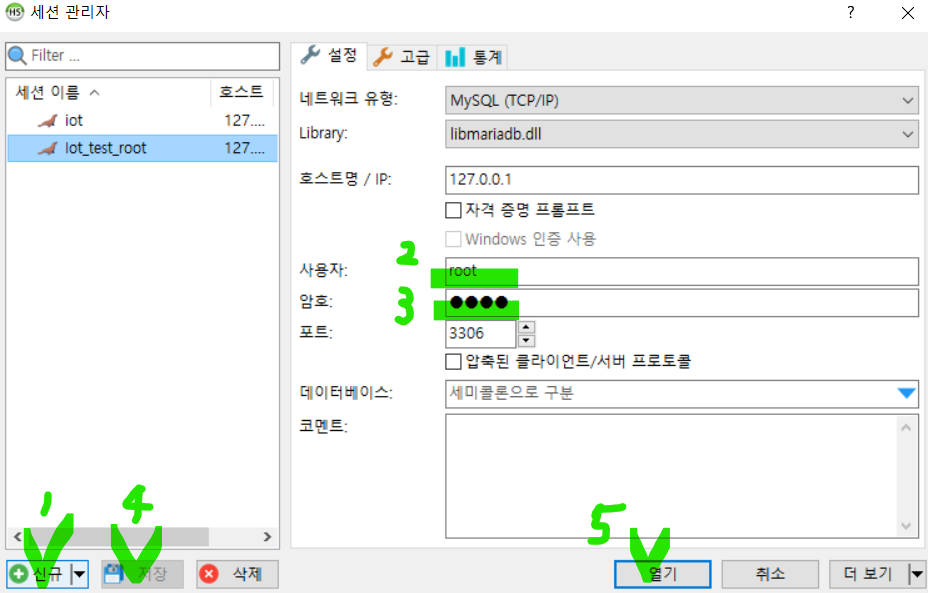
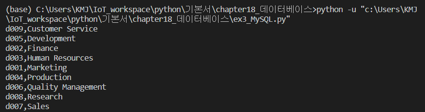
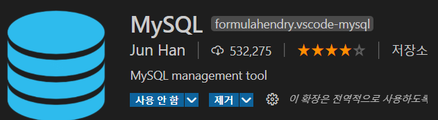
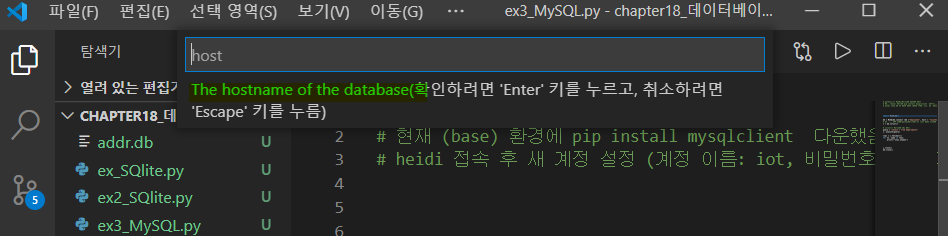
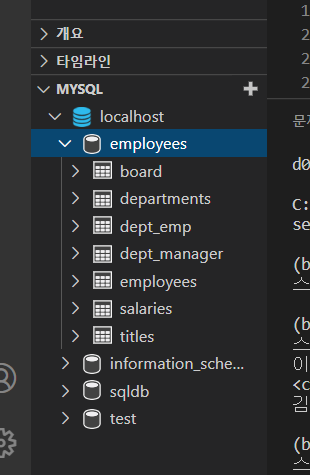

*이 문서는 'K-digital IoT 프로젝트' 수업을 통해 배운 내용을 적어 놓은 복습용 파일 입니다. 따라서 순서나 주제에서 살짝 벗어난 내용이 있을 수 있습니다.*

> *python은 VS code로 사용중입니다.*

# Python과 연동하기

## 1. SQlite3 사용

SQlite3 은 MariaDB보다훨씬 가벼운 파일기반 임베디드 데이터베이스이다. 독립적인 DBMS(ex. MariaDB) 서버 대신 라이브러리 형태로 프로그램에 포함 운영된다.  python으로 새로운 데이터베이스와 테이블을 만드는 간단한 예제를 수행해 보겠다.

1. sqlite3 모듈을 임포트 한 후 데이터를 불러온다. ( 없다면 새 데이터베이스로 만들어진다.)

```python
import sqlite3
 
con = sqlite3.connect('addr.db')
cursor = con.cursor()
```

2. 데이터 베이스에 테이블 이름이 존재하는지, 존재한다면 버리고 새로 만든다

```python
cursor. execute('Drop Table IF EXISTS tblAddr')
cursor.execute("""
CREATE TABLE tblAddr(
    name CHAR(16) pRIMARY KEY,
    phone CHAR(16),
    addr TEXT
)
""")
```

3.  테이블 내용을 입력해준다.

```
cursor.execute("INSERT INTO tblAddr VALUES('김민지', '010-0000-0000', '서울')")
cursor.execute("INSERT INTO tblAddr VALUES('김가연', '010-0000-0000', '경주')")
cursor.execute("INSERT INTO tblAddr VALUES('김래성', '010-0000-0000', '여주')")
cursor.execute("INSERT INTO tblAddr VALUES('엄명화', '010-0000-0000', '부산')")
```

4. 데이터를 저장한다. (중요!!)

```python
con.commit()
```

5. 실행을 종료한다.

```python
cursor.close()
con.close()
```

### table 출력

상단에서 만든 테이블을 cmd창으로 출력해보도록 하겠다.

- 전체를 출력하는 경우 : fetchall

```python
import sqlite3
 
con = sqlite3.connect('addr.db')
cursor = con.cursor()

cursor.execute("SELECT * FROM tblAddr")

table = cursor.fetchall()
for name, phone, addr in table:
    print(f"이름: {record[0]}, 전화: {record[1]}, 주소: {record[2]}")

cursor.close()
con.close()
```

> *select 전체 결과를 달라 : fetchall*

- 하나의 행씩 출력하는 경우 : fetchone

```python
import sqlite3
 
con = sqlite3.connect('addr.db')
cursor = con.cursor()

cursor.execute("SELECT * FROM tblAddr")

while True:
    record = cursor.fetchone()
    if record == None:
        break

    print(f"이름: {record[0]}, 전화: {record[1]}, 주소: {record[2]}")

cursor.close()
con.close()
```

- SQL 'WHERE' 명령어 사용한 경우

```python
import sqlite3
 
con = sqlite3.connect('addr.db')
cursor = con.cursor()
cursor.execute("SELECT addr FROM tblAddr WHERE name = '김민지'")
            # PK는 1개값만 존재 (없을수도 있음)
record = cursor.fetchone()
print(type(record), record)
if record : print(f"김민지는 {record[0]}에 살고 있습니다.")
else : print (f"김민지는 없는 이름입니다.")     

cursor.close()
con.close()
```

> *이 때, if문에서 record[0] 대신 record로 작성한다면, (서울, )이렇게 뒤에 쉼표가 있게 출력된다. 그 이유는 select 결과를 튜플로 받아오는데, record가 현재 튜플이고, 튜플내부 값이 한개임을 알려주기 위해 뒤에 쉼표가 붙는다.*

### table 보기

1. VS code 확장팩 'SQlite' 다운한다.



2. f1 검색기능으로 SQlite: open data base 클릭한다.
3. 원하는 파일을 선택한다.
4. 좌측 하단의 ▶ 클릭하면 테이블을 시각적으로 보여준다.

(ex) addr.db를 불러온 상태이다.





## 2. Mysqlclient 사용

 베이스를 APP으로(python처럼) 다룰 때, root 계정을 이용하는건 굉장히 위험하다. 그러므로 새로운 계정을 만드는 것이 중요하다.  다음은 새로운 계정으로 데이터베이스를 연동시킨 후 MySQLdb를 python으로 관리하는 간단한 예제를 수행해보도록 하겠다.

1. Python으로 MySQL/MariaDB 다루기 위해 Mysqlclient 를 다운했다.

```python
pip install mysqlclient 
```

> *이 때, 가상환경을 만든 적 있다면, 내가 사용할 환경을 확인 후 cmd창에 다운한다. *

2. Heidi (MariaDB의 GUI) 에 접속 후 root 계정 쿼리에서 새 계정 명령어를 입력한다.

``` mariadb
CREATE USER '<new userid>'@'%' IDENTIFIED BY '****';
GRANT ALL PRIVILEGES ON <data base>.* TO '<new userid >'@'%';
GRANT ALL PRIVILEGES ON <data base>.* TO '<new userid >'@'%';
...
(원하는 database 갯수만큼 실행)
```

> *%에는 접속 허용 머신ip, %일 경우 모두허용, \*부분은 sqlDB 내부의 테이블 중 어떤것? *은 모든 것을 뜻한다. * 

3. 다음 사진의 순서로 heidi 세션관리창을 수행한다.



4. VS code로 돌아와 MySQLdb를 import 후 connect 한다.

```python
import MySQLdb

db = MySQLdb.connect (db ="employees", host = "localhost", user="iot", passwd ="****")
c = db.cursor()

# cursor로 MariaDB SQL 실행
query = "select * from departments"
c. execute(query)

rows = c.fetchall()
for no, name in rows:
    print(f"{no},{name}")


c.close()
db.close()
```

> *연동한 iot 계정의 employees 이름의 데이터베이스에서 deparments 테이블의 값을 출력한 예제이다.*

결과 : 잘 불러와진다 



## 편리한 기능

### MySQL 다운로드

VScode로 Python을 이용해 DB를 다루다보면, Heidi로 DB내부의 테이블 이름 또는 값을 확인해야 하는 번거로움이 있다. 이 때 VS code 확장팩 MySQL을 다운로드 받아 사용한다.

> *현재, DB의 'iot' 계정에 'employees' 와 'sqldb' 데이터베이스 권한을 부여해놓은 상태이다.*

1. MySQL을 다운로드 한다.



2. 좌측 하단 MYSQL에서 +를 누른다

3.  상단 bar에 host이름,(enter  후) 사용자이름, (enter 후) 비밀번호 입력한다.  

   > *나의 경우 localhost -> iot -> \*\*\*\**



4. iot 계정의 데이터베이스 목록이 VS code에 추가된다.

