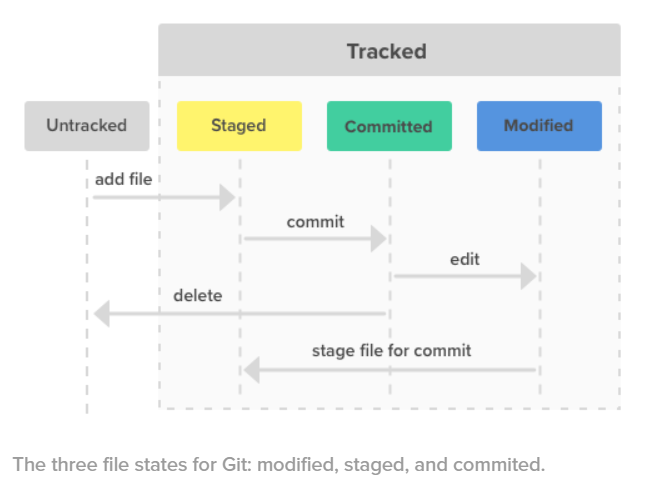
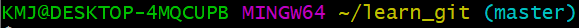
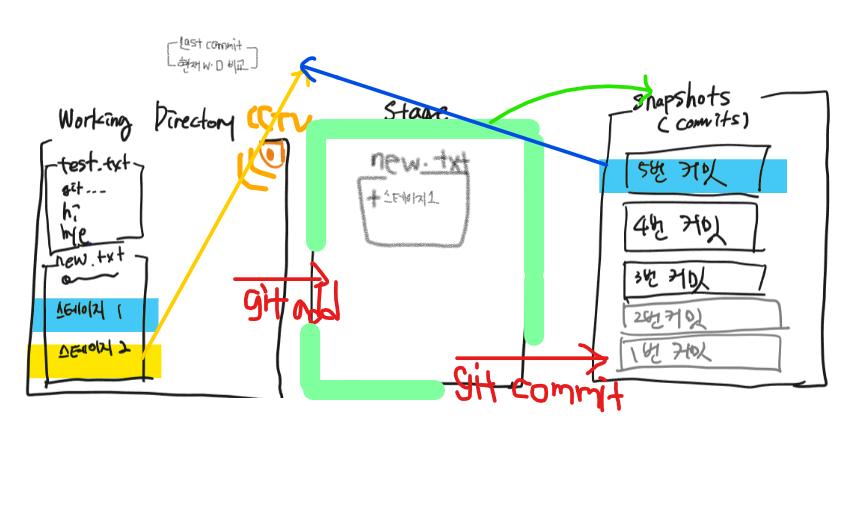

*이 문서는 'K-digital IoT 프로젝트' 수업을 통해 배운 내용을 적어 놓은 복습용 파일 입니다. 따라서 순서나 주제에서 살짝 벗어난 내용이 있을 수 있습니다.*

# Git 에 대해 배워보자

### GitHub란 무엇인가?

> *Linux를 만드신  리누스 투르발스님 구글 개발자님이 만드심. 현재 Github은 MS가 8조의 가격으로 구글로부터 인수함.*

git + hub = git이 모여있는 곳

- SCM (Source code manager), VCS(version control system) 의 한 종류로 구글에서 만든 저장소.

- 쉽게 소스코드의 변화를 추적하기 위해 사용하는 분산 버전 관리 시스템

  > 코드 version 란? (가장 보편적으로 쓰이는 의미)
  >
  > (ex)  4. 7. 6 
  >
  > 첫번째 숫자 (4) : 3->4 는 많은 것이 바뀜. 이전 버전과 API 호환 안됨
  >
  > 두번째 숫자 (7) : 6->7 은 좀 개선 됨. 이전 버전 (4.6.6, 4.5.6 ...)과 API 호환 됨.
  >
  > 세번째 숫자 (6) : 5->6 은 버그 개선됨. 

### GitHub 를 사용하는 이유

- 문서(코딩 포함)의 버전 관리를 효과적으로 하기 위해

- 현재는 Project based 중심 사회이기에 나의 배움과 경력을 효과적으로 관리 하기 위해

  > *git으로 나의 성실함을 보여주어야 한다!*

### GitHub 쉽게 사용하기 위한 3가지 조건

1. gmail로 연동한다.
2. crome을 사용한다.
3. google ing를 생활화 한다.

---

### Git 이해하기

- git 은 크게 3단계 (Untracked, staged, Committed)로 구성되어 있다. 

  > *modified 는 뒤에 예제에서 보는게 더 직관적이다.* 

  1. untracked  :  새 파일을 만들었을 경우, 아직 stage에 올리지 않은 경우
  2. staged :  파일을 무대에 올린 경우. 수정 파일인 경우에는 수정된 내용만 stage에 올라간다. (용량측에서 용이)
  3. committed : 파일의 버전이 저장된 경우. stage의 상황을 snapshot 찍듯 저장한다.

- git 설치 후 git bash 실행파일을 이용해 (CLI)명령어로 관리한다.

  > *CLI(Command Line Interface)란, 컴퓨터와 User의 상호작용을 줄 글인 명령어로 하는 것. 반대 의미로는 우리가 평소에 사용하는 GUI(Graphic User Interface)가 있다.*

##### CLI 명령어

##### VIM 명령어

##### git 도움말

- Help : `git help config `

  > *config는 설정이라는 뜻*

##### git 설정하기

- 사용자설정 : `git config —global user.name “이름”`
- 메일설정 : `git config —global user.mail “이메일”`
- config 확인
  - `git config user.name`
  - `git config user.mail`

##### git 저장소 만들기

- `mkdir learn_git`

  > *learn_git 이라는 디렉토리(폴더)를 만든다*

- `cd learn_git`

  > *home 에서 learn_git디렉토리로 들어간다*

- `git init`

  > *현재  learn_git 폴더를  git 폴더로 설정한다. Home에서는 `git init ~/learn_gift/` 로 설정해도 됨.*
  >
  > 
  >
  > *git 폴더가 되면 (master)가 붙는다!*

- `git status`

  > *현재 git 폴더 내부 상태 확인 (상태란, 파일이 수정되었는지, 수정된 파일이 stage에 올랐는지 등등 확인 위해)*

- `git status -s :`
  : OO filename
  : First O - Staging 상태를 보여줌
  : Second O - Working directory 상태를 보여줌
  : M - Modifyed
  : A - Added
  : ? - Unstaged

  

##### git 내부 파일 다루기

현재 ~/learn_git (master) 상태이다.

- `touch test.txt`

  > *test라는 이름을 가진 txt 파일을 learn_git 폴더 내부에 만든다.*

- ` git add test.txt`

  > *test 파일 stage에 올리기. 새 파일이라면 add 했을 때 바로stage에 올라감.*

- `git commit -m “initial commit”`

  >  *현재 stage에 있는 파일  모두  ''initial commit" 이라는 코멘트로 version update. 그렇기 때문에 commit 하기 전에 항상 git status 확인 하는 것이 좋음*

- 이전 commit 지우고 새로 등록하기

  1. `git commit -m ‘initial commit’`
  2. `git add forgotten_file`
  3. `git commit —amend`

- `git diff `

  > *기존 파일이 stage에 있고, 파일을 working directory에서 수정한 경우 두 차이를 보여준다.*

- `git log`

  > *commit history 보기. 시간, 작성(수정)자, 코멘트 다 나와있음*

---

##### 그림으로 이해하기

- 폴더를 `git_init` 한다는 것은 working directory 에 CCTV를 단다고 생각. (추적)

  > *working directory (WD)는 실제 작업하는 일반 폴더를 뜻 함* 

  1. 기존 git WD에 test.txt와 new.txt파일이 존재.

  2. new.txt 파일 내용에 스테이지1 추가 (CCTV(git)으로 WD와 4번 커밋 비교 중)

  3. `git add new.txt` 해서 stage에 new.txt의 변경된 부분만 올림

  4. `git commit -m '5번 커밋'` 으로 버전 업데이트

     > *만약 stage에 test.txt 도 올라와 있다면 같이 5번 커밋으로 버전 업데이트* 

  5. new.txt 파일 내용에 스테이지2 추가 (CCTV(git)으로 WD와 5번 커밋 비교 중)

     > 5번 상태에서 `git restore . ` 입려한다면, 5번 커밋 버전으로 파일 복구
     >
     > (스테이지2 없는 상태 버전)

### 

