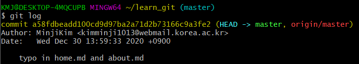
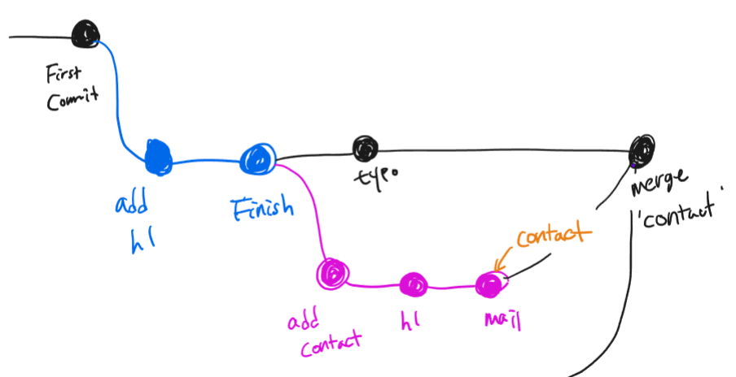
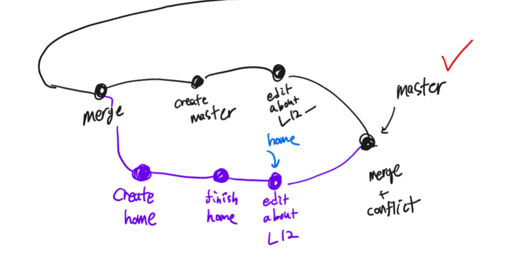
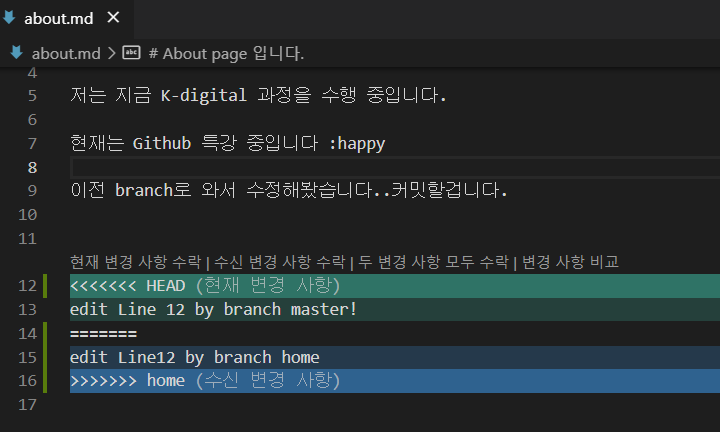
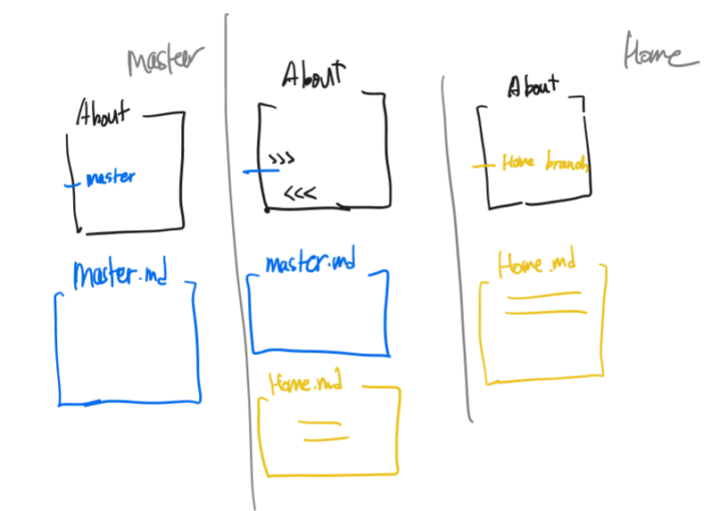

*이 문서는 'K-digital IoT 프로젝트' 수업을 통해 배운 내용을 적어 놓은 복습용 파일 입니다. 따라서 순서나 주제에서 살짝 벗어난 내용이 있을 수 있습니다.*

# Git 에 대해 배워보자 2

2020.12.30

### Github에 파일 올리기

> *이 과정에서 명령어는 모두 git bash CLI로,  home이 아닌 다루고자 하는 git directory에서 작성된 명령어이다.* 

1. github 홈페이지에 나의 계정을 만든다. 

2. github 홈페이지에서 new repository를 추가한다. (public/private 선택)

3. git bash에서 올리고자 하는 파일이 저장된  컴퓨터의 git directory (local 저장소)와 github url을 연동한다.

   `$ git remote add origin <URL>  `

4.  github (origin ) 에 올리고자하는 git 폴더 업로드 한다. 

   `git push -u origin <내 폴더의 git 이름>`

   (ex) `git push -u origin master`

---

### Git branch 이해하기

##### git branch 란 무엇인가

독립적으로 어떤 작업을 진행하기 위한 개념으로, 각각의 브랜치는 다른 브랜치의 영향을 받지 않기 때문에 여러개의 작업을 동시에 진행할 수 있다.

##### branch  장점

- SW 개발할 때, 같은 팀끼리 작업 프로젝트를 공유하고 같이 작업할 수 있다.

- 하나의 코드를 여러 버전으로 만들어, 시도하기 어려운 테스트를 할 수 있다.

##### branch 용어

- 'master' branch

  > Repository를 처음 생성하면 git은 'master'라는 이름의 branch를 자동 생성한다.

- Integration branch

  > 언제든 배포할 수 있는 버전이 통합 브랜치이다. 모든 기능이 정상적으로 동작하는 상태로, 수정할 때에는 다른 branch 생성 후 수정한다.  일반적으로 마스터 branch를 integration branch로 사용하는 경우가 많다.

- Topic branch

  > 기능을 추가하거나 버그를 수정하는 작업을 위한 branch 이다. 보통 integration branch로부터 파생되어 생성하고 완료되면 병합한다. Topic branch를 Feature branch 라고도 한다.

- Head

  > 현재 사용 중인 브랜치의 선두 부분을 나타내는 이름이다. 
  >
  > `git log` 로 Head를 알 수 있다.
  >
  > 

- Merge

  > 여러개의 branch를 하나로 모으는 기능이다. 
  
- branch 삭제

  ```
  git branch -D <branch>
  ```

  > *'-D'는 강제로 삭제할 때 사용, -D 옵션 없으면 진짜 삭제할 것인지 질문 함*

  > *branch를 삭제할 땐, 삭제하고자 하는 branch에서 벗어난 branch에서 삭제해야 함*

  > *보통 실험적으로 코드를 수정해볼 때 많이 사용. 결과가 좋지 않으면 삭제, 반면에 좋다면 merge 하면 됨!*


### branch 실습

#####  fast forward merge 와 auto merge

동그라미는 commit, edge는 branch를 뜻한다. 



상황1 (fast forward) : 새 branch가 master branch의 이력을 모두 포함하고 있는 경우, master branch를 head로 만들 때 사용

상황2 (auto merge)  : 서로 다른 branch로 겹치지 않는 부분을 수정 후 merge 한 경우, git에서 자동으로 merge된 상황을 commit 해 줌.

1. git_learn 폴더를 git 폴더로 초기화 한다.

   ```
   mkdir git_learn
   cd git_learn
   git init   
   ```

2. file 1.md file 생성 후 commit 한다 (메시지 : First commit)

   > *기본 branch는 master branch 이다. 따라서 First commit 은 master branch에 위치하고 있음*

   ```
   touch file1.md
   git add file1.md
   git commit -m 'First commit'
   ```

3. 새로운 branch  'about'  생성과 동시에 head branch를 about으로 설정한다.

   ```
   git switch -c about
   ```

4. about.md file 만들고 내용에 hi  추가 후 commit 한다 (메시지 : add hi) 

   ```
   touch about.md
   git add file1 && git commit -m 'add hi'
   ```

5. about.md 파일 내용에 finish 내용 추가 후 commit 한다. (메시지 : finish)

   ``` 
   git add about.md && git commit -m 'finish'
   ```

6. 'about' branch를 'master' branch와 병합한다

   ```
   branch switch master # 흡수 할 branch가 주체여야 함
   git merge about
   ```

   > *merge 후, `git log` 하면, **'fast forward'** 문구가 뜬다.  이 뜻은 master branch가 최신 about 브랜치를 흡수했다!*

7. 새로운 branch  'contact'  생성과 동시에 head branch를 contact로 설정한다.

   ```
   git switch -c contact
   ```

8. contact 파일 생성 후 commit 한다 (메시지 : add contact)

   ```
   touch contact.md
   git add contact.md && git commit -m 'add contact'
   ```

9. contact 파일에 hi를 추가하여 수정 후 commit 한다 (메시지 : hi)

   ```
   git add contact.md && git commit -m 'hi'
   ```

10. contact 파일에 mail을 추가하여 수정 후 commit 한다 (메시지 : mail)

    ```
    git add contact.md && commit -m 'mail'
    ```

11. master branch로 돌아가 기존 about.md 파일에 오타를 수정 후 commit 한다. (메시지 : typo)

    ```
    git switch master
    git add about.md && git commit -m 'typo'
    ```

12. 'contact' branch를 'master' branch와 병합한다.

    ```
    git switch master # 흡수 할 branch가 주체여야 함
    git merge contact
    ```

    > *merge 하면, vim으로 **'두 개 합친 commit 자동으로 만들께!'** 문구가 뜬다.*

    > *contact branch와 master branch 내용 중 동시에 수정해 겹친 내용이 없으므로 merge 후 git에서 알아서 commit 해준다*.

##### 수동 merge



상황3  : 서로 다른 branch로 겹치는 부분을 수정 후 merge 한 경우, 수정된 두 내용을 모두 보여주어 수동으로 처리하도록 해 줌. (VC code를 이용하면 선택지를 주기에 수월함)

> *위 git_learn 이라는 git 폴더에서  최종적으로 contact branch와 merge한 master branch(12번)에서 이어서 실습.*

1. 새로운 branch  'home'  생성과 동시에 head branch를 home으로 설정한다.

   ```
   git switch -c home
   ```

2. home.md 파일 생성 후 commit 한다 (메시지 : create home)

   ```
   touch create.md
   git add create.md
   git commit -m 'create home'
   ```

3. home.md 파일 내용 수정 후 commit 한다. (메시지 : finish home)

   ```
   git add home.md && git commit -m 'finish home'
   ```

4. 기존 about. md 파일의 12번째 줄 수정 후 commit 한다. (메시지 : edit about.md L12)

   ```
   git add about.md && git commit -m 'edit about.md L12' 
   ```

5. master branch로 돌아가서 master.md 파일 생성 후 commit 한다. (메시지 : create master)

   ```
   git switch master
   touch master.md
   git add master.md && git commit -m 'create master'
   ```

6. 기존 about.md 파일의 12번째 줄 수정 후 commit 한다. (메시지 : edit about L12-)

   ```
   git add about.md && git commit -m 'edit about.md L12-'
   ```

7. master branch에서 'home' branch 와 병합한다.

   ```
   # 현재 master branch임. 흡수 할 branch가 주체여야 함
   git merge home
   ```

   > *merge 하면, VC code에서 다음과 같이 about.md 파일에 겹치게 수정 된 부분을 모두 띄어 주고 어떻게 수정할 것인지 수동으로 처리하도록 한다. (현재 변경 사항 수락 / 수신 변경 사항 수락 / 두 변경 사항 모두 수락 선택지 존재)*

   > *이 때, 겹치지 않는 home.md와 master.md는 자동으로 merge 됨*

   

8. 원하는 방향으로 수동 수정 후, 수동으로 staging, commit 함

   ```
   # 현재 master branch
   git add .
   git commit -m 'finish 수동 merge'
   ```

   



---

### Git 명령어 

> *유용한 명령어를 배울 때마다 추가될 예정*

##### git directory 삭제하기

- `rm -r <directory>/`

  > *진짜 삭제할건지 경고 메시지 뜸*

- `rm -rf <directory>/`

  > *바로 삭제됨. 경고메시지 안 뜸. 그만큼 위험!*

##### git bash에서 파일 열기

- `start <file>`
- `ls` 후 파일 목록 중 원하는 파일 `ctrl`+마우스 커서

##### help 사용하기

- `git <command> -h`

  > *(ex) remote 명령어 사용법이 궁금하면 `git remote -h`*  


##### commit graph 보기

-  `git log --pretty=format:"%h%s" --graph`

  > *branch merge 그래프 입니다.*

---

### Summary today CLI

```gitbash
$ git remote add origin <URL>  # git remote add <name> <URL>
$ git push origin master # git push <name> <branch>

$ git branch
$ git branch <branch>
$ git branch -d <branch> 
$ git branch -D <branch>

$ git switch <branch>
$ git switch -c <branch> = $ git checkout <branch/id>  # branch 생성과 동시에 Head로 설정

$ git chechout <branch/commit_id>

$ git merge <branch> # 주 branch에서 합치고자 하는 branch를 < >에 입력


```