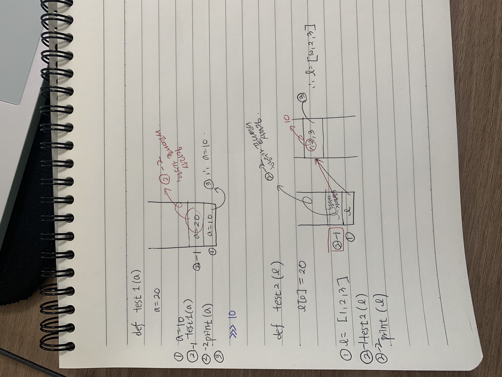
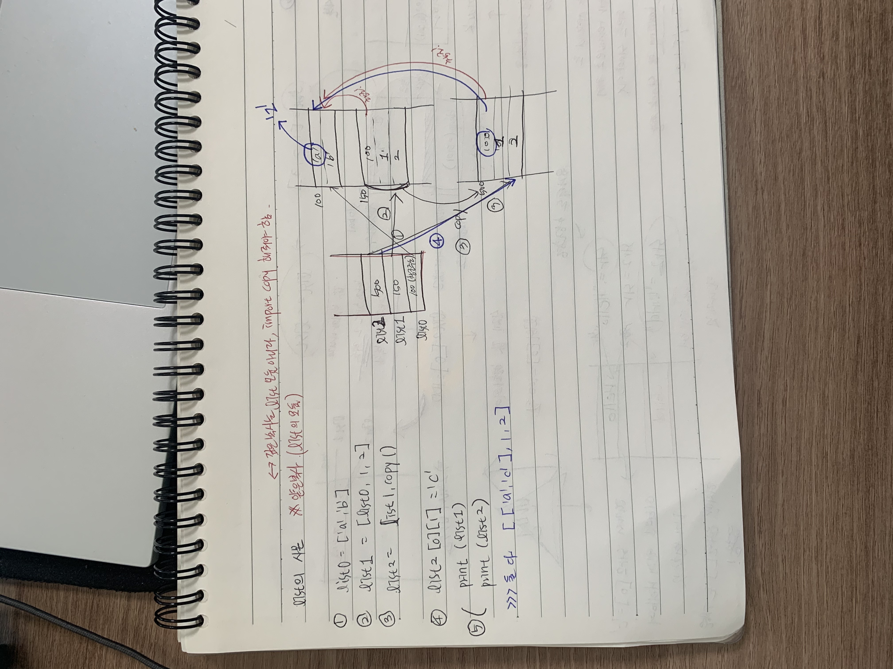

### 참조형 변수, 일반형 변수

``` # call by value ----> 함수의 매개변수에 대입되는 것이 참조형인지, 일반형인지에 따라 결정. 일반형이면 value , 참조형이면 reference
(따라서 예시로 리스트면 reference임.)
def test1(a):
    a=20
a=10
test1(a) # 값의 복사본이 넘어감. 함수 끝나고 return 되면서 저장된 a=20데이타는 사라짐.
print(a)

​```# call by reference
def test2(l):
    l[0]=20
a=10
test2(l) #참조형이 넘어간 후, 참조 데이터(원본 데이터)가 변경됨. 그리고 
함수가 끝나면서 생겼던 함수의 l 지역변수는 사라짐. 
print(l)


```





