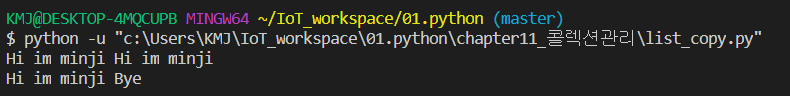
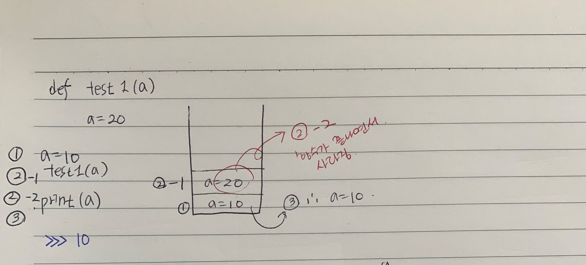

# 리스트의 사본

*리스트는 일반 변수와 달리, 원본 하나로 작업이 이루어진다. 따라서 리스트 사본의 값을 변경하면 원본 값도 변경하게 된다. 자세한 설명 전에 python 변수의 종류부터 정리해보자.*

### 변수의 종류

1. 기본형 (Primitive Type) : 실제 값(literal)을 저장한다.

   (ex) 숫자, 문자, booling(True/False) etc...

2. 참조형 (Reference Type) : instance의 주소값(참조값)을 저장한다.

   (ex) 문자열, list, etc...

   > *참조란 , 실제 데이터 저장은 다른 곳에 하고 변수들은 그 메모리 주소를 참조하고 있다로 이해하면 좋다.*

### Ex.01

- list가 reference type임을 보여주기 위한 예시

```
list1 = [1, 2, 3]
list2 = list1

list2[1] = 100   # list2는 list1과 같은 곳을 참조하고 있기에
print(list1)	 # 원본 list 값이 변한다. 
print(list2)
print(list1 == list2)
```


---

### Ex.02 

- 문자열이 reference type임을 보여주기 위한 예시

- (중요) 사본 str2에서 Bye로 바꿨을 땐, 메모리에 Bye가 저장장소가 새로 생기고 str은 저장 장소의 주소를 참조값으로 갖게 됨.

- 만약, Ex.01 처럼 str2[0]='B' 라면, 두 변수가 참조하고 있는 'Hi I'm minji'의 값이 달라지게 될 것. 그러나 문자열은 element([0]) 기능을 수행하지 못함! 

```
str = 'Hi I\'m minji'
str2 = str
print(str, str2)
str2 = "Bye"
# str2[0] = 'h'    # 문자열에서는 element 기능을 수행하지 않음. 
print(str, str2)   # 참조 요소가 아니라 변수가 가리키는 참조값 
				   # 메모리 변수가 바뀐 것.
                   #따라서 str2 만 바뀜.
```




---

### Ex.03



- Call by Value

1. 변수 a에 숫자 10을 저장한다.  

   =  stack에 'a=10' 이라고 저장된다.

2. 함수 test1을 수행한다.

   = stack에 지역변수 'a=20'이라고 저장된다.

3. 함수가 종료한다.

   = 지역변수 'a=20'은 함수가 끝나면서 메모리에서 사라진다.

4. print(a) 의 출력값은 10이 된다.


---

### Ex.04


- Call by Reference

1. 변수 l 에 리스트 [1,2,3]을 저장한다. (1과정)

   =  memory에 데이터 [1,2,3]이 저장되고 저장된 주소(참조값)를 변수에      저장한다. 

   > *리스트는 참조형이므로 값이 아닌 데이터가 저장된 주소값을 변수에 저장한다.*

2. 함수 test2의 매개변수에 l이 적용된다. (2-1과정)

   = stack에 지역변수 l을 만들고, 지역변수 l은 데이터[1,2,3] 주소를 참조한다.

3. 함수 test2에서 참조 값의 [0]를 20으로 변경한다.  (2-1과정)

   =  지역변수 l이 참조하고 있는 데이터의 첫 번째 값을 20으로 바꾼다.

4. 함수가 종료한다.

   = 지역변수 l은 함수가 끝나면서 메모리에서 사라진다. (2-2과정)

5. print(l) 의 출력값은 [20,2,3]이 된다.

   = stack에 지역변수 l을 만들고, 지역변수 l은 데이터[1,2,3] 주소를 참조한다.

>  *call by value, call by reference 는 함수의 매개변수에 대입되는 것이 참조형인지, 일반형인지에 따라 결정. 일반형이면 value , 참조형이면 reference.*


---

### Ex.05


- list의 얕은 복사 예시

1. list0에 ['a', 'b']를 저장한다. (1과정)

   =  memory에 데이터 ['a', 'b']가 저장되고 저장된 주소(100)을 변수 list0에 저장한다. 

   > *참조하고 있다는 것을 화살표로 표현 했음.*

2.   list1에 [list0, 1,2]를 저장한다.( 2과정)

    = memory에 데이터 [100(주소), 1, 2]가 저장되고 저장된 주소(150)을 변수list1에 저장한다.

   > *참조에 참조 가능*

3. list2에 list1가 참조하고 있는 데이터를 복사해 저장한다. (3과정) 

   =  memory에 복사된 데이터  [100(주소), 1, 2]가 저장되고 저장된 주소(500)을 변수 list2에 저장한다. 

   > *list1이 참조하는 list0의 참조값도 그대로 복사해서 참조한다.*

4.  list2의 \[0][1] element 값을 'c'로 바꾼다.

    = list2의 \[0][1] 값은 list0의 주소값이다. 따라서 list0 데이타가 있는 주소 100으로 찾아가 두 번째 element인 'a'가 'c'로 바꾼다.

5.  list1과 list2를 출력값은 둘 다 [['a', 'c'],1, 2]이 된다.

   =  list1과 list2 모두 list0의 데이타 주소 값을 참조하므로, list2에서 element 바꾼 값이 그대로 list0의 주소를 참조하는 모든 변수에 적용된다. 한마디로 원본 값이 바뀐 것이다.

   

