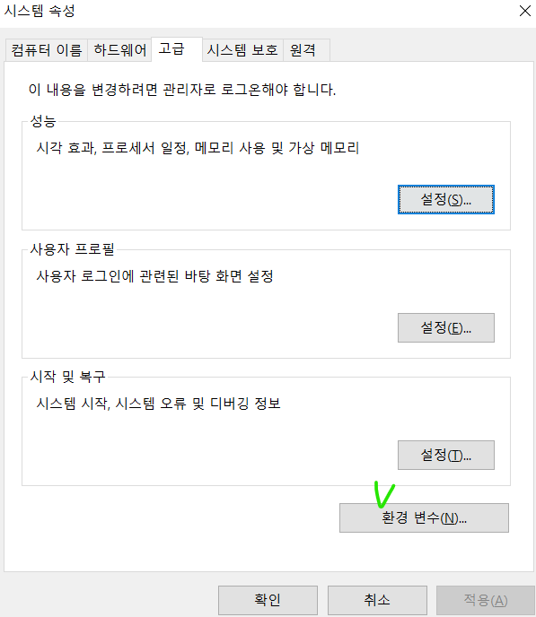
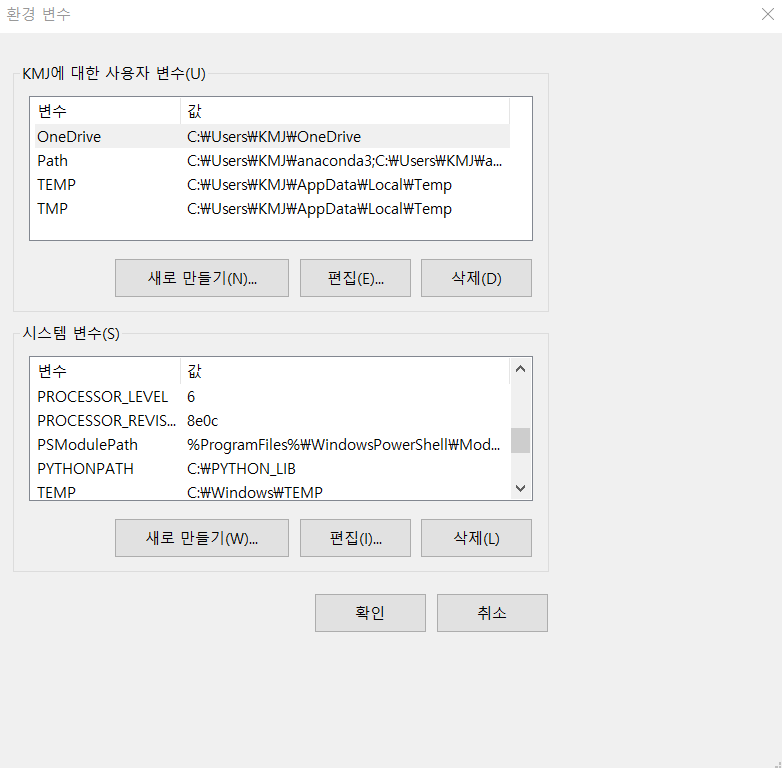
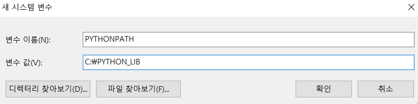
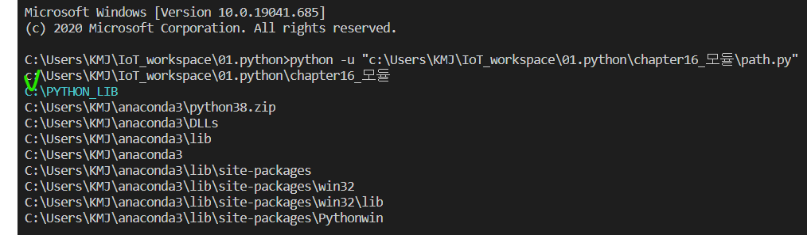
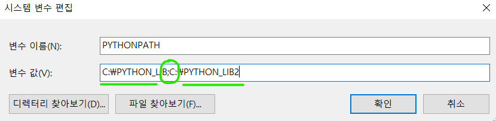

# Python module

### module path 만들기

내가 만든 module, 워킹 디렉토리마다 파일 복사 없이 import 하기!

1. 파일 탐색기를 열어 내PC(우클릭) / 속성에 들어간다.

2. 시스템 / 고급시스템설정 클릭한다.

3. 고급 / 환경 변수(N)... 을 클릭한다.

   

4. 시스템변수/새로만들기(W) 클릭한다!

   

5. 내 PC 원하는 장소에 폴더를 만들고 절대주소를 복사해 다음과 같이 작성한다. 

   > *변수 이름은 PYTHONPATH 여야 함!!*



6. 작성중인( 또는 열려있던) 코드를 모두 종료 후 다시 실행시킨다. 

   > *코드 환경이 새로 시작될 때 환경 변수가 추가되기 때문*

7. ```
   import sys
   
   for path in sys.path;
   	print(path)
   ```

8. 7번 코드로 내가 만든 모듈 파일이 모듈 경로에 추가되었는지 확인한다.

   

   > *보통 2,3번째에 추가됨! 기존 모듈 파일보다 우선순위가 높음을 알 수 있음.*
   >
   > *인터넷으로 다운받은 모듈이 가장 마지막에 표현됨.*

9. 만든 사용자 모듈 폴더가 가득 차서 새로 만들고 싶을 경우, 1~4번까지 같은 방법으로 만든 후 추가 대신 PYPATH 편집을 선택한다.  5번 과정에서 변수값에 ; 로 추가한다.

   