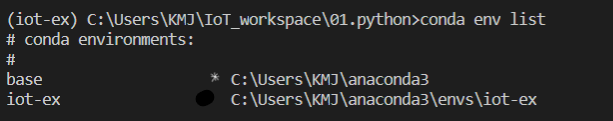
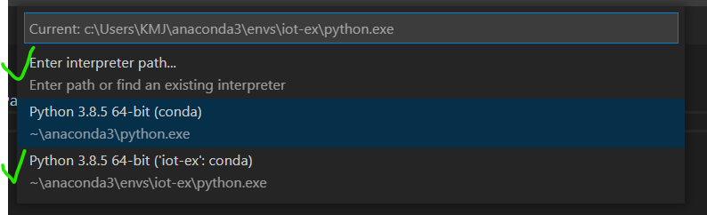
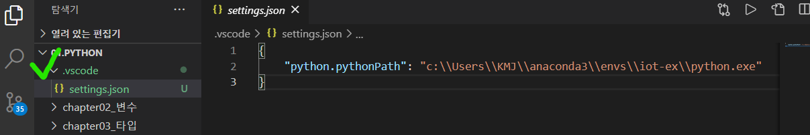
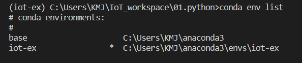
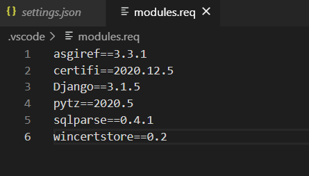

# conda 가상환경 

### 가상환경 쓰는 이유

- 파이썬에서는 한 라이브러리에 대해 하나의 버전만 설치가 가능
- 여러개의 프로젝트를 진행하는 경우 프로젝트마다 동일 패키지에 대해 다른 라이브러리 또는 다른 버전을 사용하는 경우 문제
- 이를 방지하기 위한 격리된 독립적인 가상환경을 제공
- 일반적으로 프로젝트마다 다른 하나의 가상환경을 생성한 후 작업을 시작

### conda python 가상환경 설치 방법

> *Anaconda Python을 설치했고, VS code 를 사용해서 실행시키고 있다.*
>
> *VS code의 cmd 창에서 명령어 실행*

```
conda env list
```

1. 현재 conda의 환경 list를 확인한다.

   >  *기본적으로 base에 \* 선택되어 있다.*

2. 명령창에 가상환경 만드는 명령어 입력

   ```
   conda create name <virtual name> python=<version>
   ```

   > *나의 경우 virtual name : iot-ex, version : 3.8*

3. 중간에 Proceed ([y]/n)? 질문에 y 또는 enter 입력

4. 현재 conda의 환경 list로 가상환경 설치 경로 확인한다.

   

5. 가상환경으로 변경시켜 주기 위해 VS code 에서 f1키, python select Interpreter 입력한다.

   

   > *이 때, 3번째 처럼 바로 뜨면 누르면 됨 *
   >
   > *뜨지 않는다면, 첫 번째를 누르고 4번에서 확인한 절대 위치로 파일들어가 python.exe. 선택해주면 됨.*

6. .vscode와 하위에 setting.json 생기면 제대로 설치 되었고, 해당 VM으로 실행중인 것.

   

7. 새 cdm 창에서는 다음과 같이 (bash)-> (iot-ex)로 변경!

   

### 가상환경 명령어

##### 가상환경 활성화
- conda activate < virtual name>

- conda activate python_study
  (python_study ) C:\workspace\01_python>

##### 가상환경 비활성화

- conda deactivate
  (python_study ) workspace\01_python > conda deactivate
  C:\workspace\01_python

##### 가상 환경 삭제하기

- conda remove --name \<virtual name> --all
- conda remove --name python_study --all

### 가상환경 버전 맞추기

> *여러 사람과 프로젝트를 수행할 때, 기존 가상환경을 이용하려 할 때, 모두 같은 버전 환경으로 맞춰야 할 때 수행*

1. 버전정보가 들어있는 파일을 현재 디렉토리에 저장한다.

   

2. 동기화 시키고자 하는 가상환경 cmd 명령창에 다음 명령어 입력

   ```
   pip freeze > modules.req
   ```

3. 파일 버전을 바탕으로 설치

   ```
   pip install -r modules.req
   ```

   

### 외부 모듈 관리 pip

- install : 패키지를 설치
- uninstall : 설치한 패키지를 삭제한다
- freeze : 설치한 패키지의 목록을 보여준다
- show : 패키지의 정보를 보여준다

- search : pyPI 에서 패키지를 검색한다